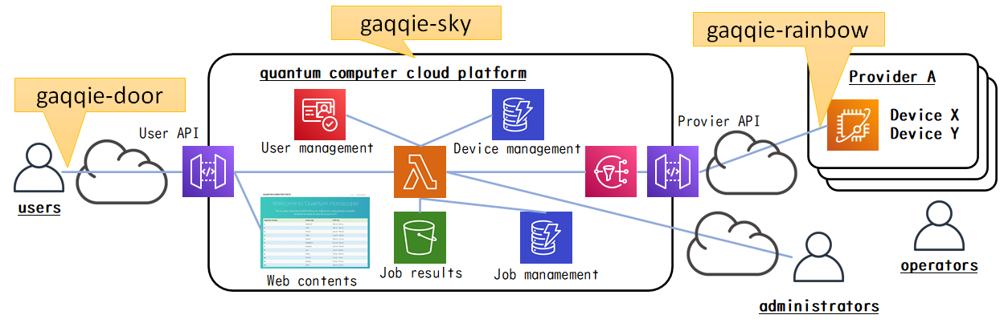

# gaqqie: an open-source quantum computer cloud platform

**This is a beta version.**

## What is **gaqqie**?

**gaqqie** is an open-source quantum computer cloud platform. Quantum computer providers can easily build a cloud platform using **gaqqie**.  
**gaqqie** is named for "**Ga**te-based **Q**uick **Q**uantum **I**nfrastructur**e**".

The main purposes of **gaqqie**

- Provides standard features of a quantum computer cloud platform.
- Less operational effort and lower cost.
- Easy to scale even as the number of users and quantum circuit jobs increases.
- Free choice of combination of quantum programming language and quantum computer provider.

## Elements of **gaqqie**

| Build | Version |
| ---   | ---     |
| [**gaqqie-sky**](https://github.com/gaqqie/gaqqie-sky) |  |
| [**gaqqie-door**](https://github.com/gaqqie/gaqqie-door) |  |
| [**gaqqie-rainbow**](https://github.com/gaqqie/gaqqie-rainbow) |  |

## Architecture of **gaqqie**

**gaqqie** consists of several elements.

- **gaqqie-sky** is a quantum computer cloud platform. **gaqqie-sky** is supposed to be deployed on AWS(Amazon Web Services).
- **gaqqie-door** is a client library for users to access the quantum computer cloud platform **gaqqie-sky**, written in python.
- **gaqqie-rainbow** is a library for providers to access the quantum computer cloud platform **gaqqie-sky**, written in python.

The architecture of **gaqqie** is as follows:

## Citing

If you use gaqqie in your research or product, please reference this URL ([CITATION.cff](CITATION.cff)).

## Supports

**gaqqie** development is supported by [IPA(Information-technology Promotion Agency, Japan), the MITOU Target Program 2021](https://www.ipa.go.jp/jinzai/target/2021/gaiyou_ty-1.html). (June 2021 -)

